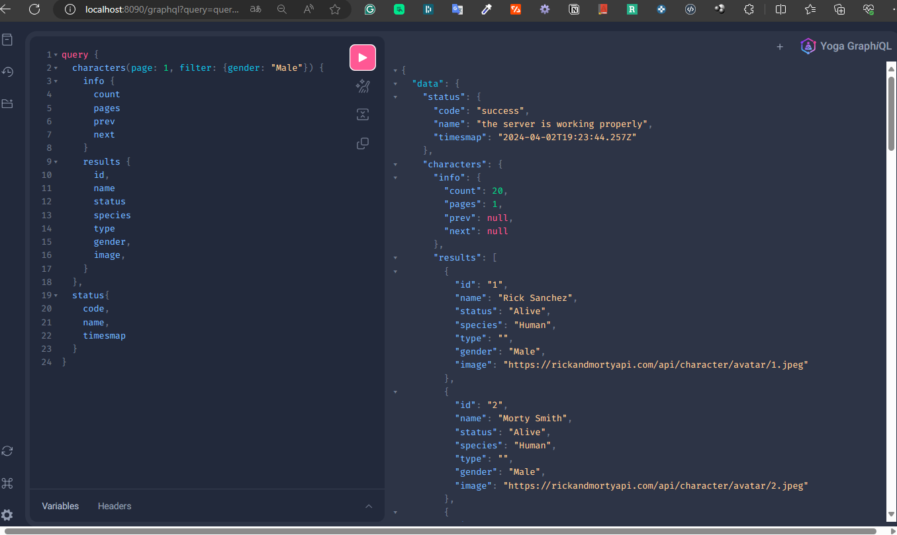
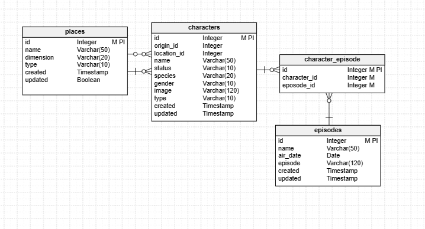

# Rick and Morty API

### Kata - Demonstrative project only
# Kata Rick and Morty 

## Índice
- [Description](#description)
- [Installation](#installation)
    - [Prerequisites](#prerequisites)
    - [Used technology](#used-technology)
    - [Installation and commissioning steps](#installation-and-commissioning-steps)
- [Examples of Use](#examples-of-use)
    - [Basic Query](#basic-query)
    - [Available Filters](#available-filters)
    - [Pagination](#pagination)
    - [ A look at the result](#a-look-at-the-result)
- [E/R Model](#er-model)


## Description

This project is a backend application developed in Node.js, using Express and GraphQL Yoga to create an API that consumes the public Rick and Morty API. The application also implements caching with Redis to improve performance and uses a SQL database (Postgres) to manage data. It is designed to demonstrate skills in creating modern and efficient APIs with Node.js, integrating various technologies and design patterns.

## Installation

### Prerequisites

Before installing and running this application, make sure you have the following tools in their specified versions or higher:

- **[Node.js](https://nodejs.org/) (versión 18.0.0 o superior):** Node.js is a runtime environment for JavaScript built with Chrome's V8 JavaScript engine.

  To check the version, use: `node -v`
  
- **[npm](https://docs.npmjs.com/) (versión 10.0.0 o superior)**

  To check the version, use: `npm -v`

- **[Postgres](https://www.postgresql.org/download/) (versión 12.18 o superior)**

    To check the version, use: `psql --version`.

- **[Redis](https://redis.io/download) (versión 5.0.7 o superior)**

    To check the version, use: `redis-server --version`.


### Used technology

This project makes use of several prominent technologies and libraries in web and API development, including:

- **[Express.js](https://expressjs.com/)**: Web Application Framework for Node.js.
- **[GraphQL Yoga](https://the-guild.dev/graphql/yoga-server)**: Complete server implementation for GraphQL.
- **[Redis](https://redis.io/)**: Storage of data structure in memory, used as a database, cache and message broker.
- **[PostgreSQL](https://www.postgresql.org/)**: Powerful, open source relational database management system.
- **[Sequelize](https://sequelize.org/)**: ORM for Node.js for Postgres, MySQL, MariaDB, SQLite and Microsoft SQL Server.
- **[TypeScript](https://www.typescriptlang.org/)**: TypeScript is a strongly typed programming language that builds on JavaScript, giving you better tooling at any scale.


### Installation and commissioning steps
1. **Clone the repository:**
   ```bash
   git clone <url-del-repositorio>
   
   cd kata-rick-and-morty
   ```

2. **Install dependencies:**
    ```bash
    npm install
    ```

3. **Configure environment variables:**
Copy the `.env.example` file to `.env` and adjust the environment variables according to your configuration.

4. **Run database migrations and seeders: **(make sure you have a database created)
    ```bash
    npm run database:migrate

    npm run database:seed
    ```

5. **Start the application:**
- Para desarrollo:
  ```
  npm run dev
  ```

## Examples of Use

In this section, you will find examples of how to query the GraphQL API to obtain data from Rick and Morty characters, using various filters.

### Basic Query

To get a list of characters filtering by name, you can use the following GraphQL query:

  ```graphql
  query { 
    characters(page: 1, filter: {name: "Rick Sanchez"}) {
      info {
        count,
        pages,
        prev,
        next,
      }
      results {
        id,
        name,
        status,
        species,
        type,
        gender,
        image,
      }
    },
    status{
      code,
      name,
      timesmap,
    }
  }
  ```

  This query returns information about characters whose name contains the "Rick Sanchez", including pagination and query metadata.

### Available Filters

You can filter the characters using the following criteria:

- `name`: Filters characters by name. Case insensitive search.
species: Filter characters by species. Case insensitive search.
- `gender`: Filter characters by gender. It must be an exact match.
- `status`: Filters characters by status (alive, dead, unknown). It must be an exact match.
- `origin`: Filter characters by their origin. Case insensitive search.

### Pagination

The API supports pagination for character queries. By default, `20 items` are displayed per page, and the first page is displayed if the page parameter is not provided.

To navigate through pages, you can modify the value of the `page` parameter in your query.

### A look at the result



### E/R Model

